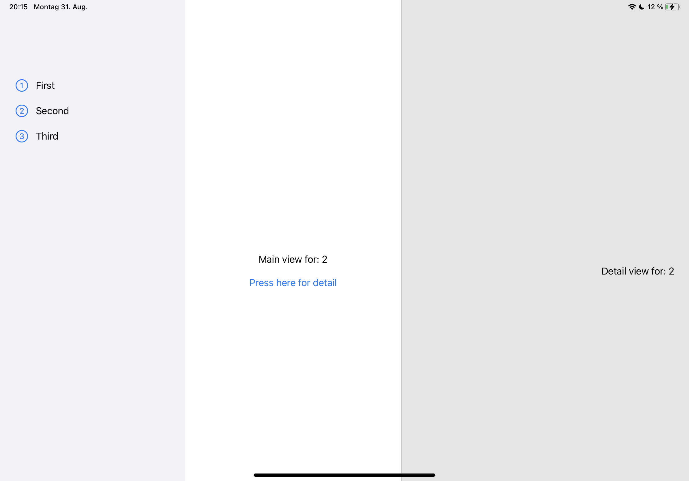
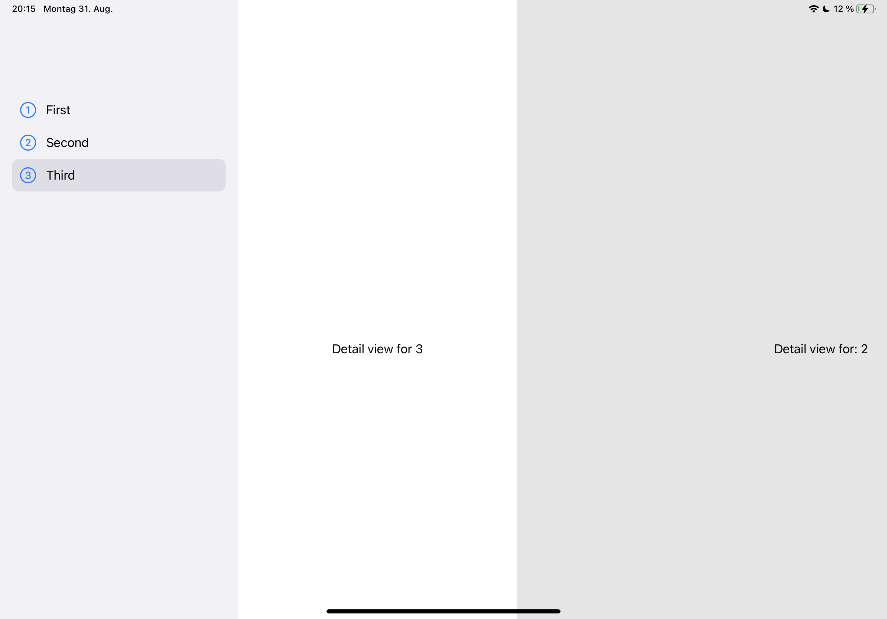

#  SwiftUI Example

Strange `NavigationView` behaviour when changing between 2 and 3 column layout, while having a sidebar.

I have noticed an unexpected behavior in the SwiftUI NavigationView.

### Context

Within the WWDC session ["Design for iPadOS"](https://developer.apple.com/wwdc20/10206) it is described that an iPadOS app should use the sidebar instead of tabs if possible. I want to implement this in my app [PDF Archiver](https://pdf-archiver.io). One tab uses a splitscreen view (document list and detail view), the other tabs do not. This implementation is currently not possible in SwiftUI.

* Xcode Version 12.0 beta 6 (12A8189n)
* iPadOS 14 beta 6 & 7 & 8

### Steps to reproduce

To reproduce the behavior the following code ([Source](https://developer.apple.com/forums/thread/653288)) serves as a minimal example:
```swift
struct ContentView: View {
    var body: some View {
        NavigationView {
            SidebarView()
            Text("Main")
            Text("Detail")
        }
    }
}

struct SidebarView: View {
    var body: some View {
        List {
            NavigationLink(destination: DetailSplitView(number: 1)) {
                Label("First", systemImage: "1.circle")
            }
            NavigationLink(destination: DetailSplitView(number: 2)) {
                Label("Second", systemImage: "2.circle")
            }
            NavigationLink(destination: DetailNoSplitView(number: 3)) {
                Label("Third", systemImage: "3.circle")
            }
        }
        .listStyle(SidebarListStyle())
    }
}

// Working as expected in a split view context
struct DetailSplitView: View {
    let number: Int
    var body: some View {
        VStack(spacing: 20) {
            Text("Main view for: \(number)")
            NavigationLink(destination: Text("Detail view for: \(number)")) {
                Text("Press here for detail")
            }
        }
    }
}

// Ideally want this to take up the whole screen (not just one side of a split view)
struct DetailNoSplitView: View {
    let number: Int
    var body: some View {
        Text("Detail view for \(number)")
    }
}
```


### Expected Behaviour
`Main view 2` and `Detail view 2` are shown side by side in a split view next to the sidebar.



### Unxpected Behaviour
`Main view 3` and `Detail view 2` (previously shown) are shown side by side in a split view next to the sidebar. `Main view 3` should take up the full space right of the sidebar.



The same behaviour can be seen in the following code:

```swift
// Source: https://swiftwithmajid.com/2020/07/21/sidebar-navigation-in-swiftui/

@main
struct TestProjectApp: App {
    @StateObject var store = MailStore()
    @State private var selectedLabel: String? = "Inbox"
    @State private var selectedMail: Mail?

    var body: some Scene {
        WindowGroup {
            NavigationView {
                Sidebar(
                    store: store,
                    selectedFolder: $selectedLabel,
                    selectedMail: $selectedMail
                )

                if let label = selectedLabel {
                    FolderView(
                        title: label,
                        mails: store.allMails[label, default: []],
                        selectedMail: $selectedMail
                    )
                } else {
                    Text("Select label...")
                }

                // Only show sidebar + 2 columns in Inbox
                if selectedLabel == "Inbox" {
                    if let mail = selectedMail {
                        MailView(mail: mail)
                    } else {
                        Text("Select mail...")
                    }
                }
            }
        }
    }
}
```

### Additional Resources

* [Developer Forum Thread](https://developer.apple.com/forums/thread/653288)
* [Twitter Community Question](https://twitter.com/JuKa1205/status/1300041324289232896) 
* [SwiftUI Sidebar Navigation Tutorial](https://swiftwithmajid.com/2020/07/21/sidebar-navigation-in-swiftui/)
